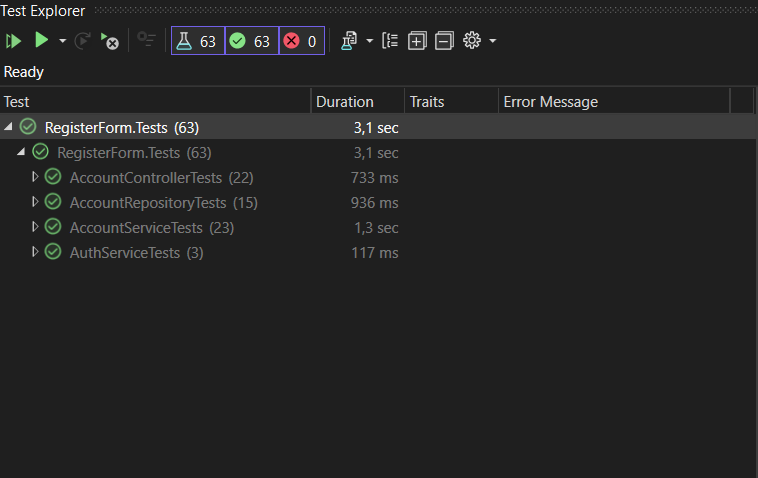

# RegisterFormApp
Web Application for register and login

## 1. Използвани технологии
- **C# и .NET 8** – за изграждане на сървърната логика.
- **HttpListener** – за приемане и обработка на HTTP заявки без пълен web server.
- **SQL Server** – за съхранение на потребителските данни.
- **HTML, CSS и JavaScript** – за front-end частта на приложението.
- **XUnit и Moq** – за Unit тестове на функционалностите.

## 2. Функционалности и тяхната реализация

## **Функционалност: Валидация на данните (имейл, имена, парола и др.)**

В системата е реализиран цялостен механизъм за валидиране на потребителските данни, който осигурява както коректността, така и сигурността на въведената информация.  
Валидацията се извършва **на два етапа** – **клиентска (в браузъра)** и **сървърна (в контролера)**.

---

### **1. Клиентска валидация**

Преди изпращане на заявката към сървъра, формите (например регистрация и вход) извършват първоначална проверка чрез **JavaScript**.  
Така се предотвратява изпращането на невалидни данни и се намалява натоварването върху сървъра.  

Основните проверки, които се извършват на клиентската страна, са:  

- Проверка на имейл адрес чрез **регулярен израз (Regex)**, гарантиращ правилен формат.  
- Проверка дали **паролата отговаря на минимални изисквания за дължина** и дали съвпада с полето „потвърди парола“.  
- Проверка на **телефонния номер** – разрешени са само цифри и символ „+“, като дължината е ограничена.  
- Проверка на **възрастовия диапазон** – при регистрация потребителят трябва да е на възраст между **13 и 150 години**.  
- Ако някое от условията не е изпълнено, формата **не се изпраща към сървъра**, а грешките се визуализират директно под съответните полета чрез HTML елементи (``).

---

### **2. Сървърна валидация**

След като данните преминат клиентската проверка и бъдат изпратени, **класа `Router`** прихваща HTTP заявката.  
В зависимост от маршрута (`/Account/Register`, `/Account/Login`, `/Account/Edit` и т.н.), `Router` извлича подадените данни и ги подава към съответния контролер чрез **POST метод** (например `RegisterPost()`, `LoginPost()`).  

Контролерите (`AccountController`, `HomeController` и др.) изпълняват **сървърна валидация**, която е независима от клиентската и служи като последна защита срещу некоректни или злонамерени входни данни.  

 Извършват следните проверки:  

- Проверка дали всички задължителни полета са попълнени.  
- Проверка за **валидност на имейл и телефонен номер** чрез регулярни изрази.  
- Проверка дали паролата **отговаря на изискванията за сигурност** (минимална дължина, съвпадение с потвърдената парола).  
- Проверка на **възрастовата граница** чрез изчисляване на разликата между текущата дата и датата на раждане.  
- Проверка дали **потребител с този имейл или потребителско име вече съществува** в базата данни.  
- Проверка на **CAPTCHA кода**, съхраняван в сесията, за защита от автоматизирани регистрации.  

Ако при някоя от тези проверки се установи несъответствие, контролерът връща същия изглед (`.html` файл) с подходящи съобщения за грешка, без да се извършват промени в базата данни.  
Само при успешно преминаване на всички валидации се продължава с обработката и записването на данните.

## Функционалност: Записване на данните в релационна база данни

**Таблица:** Users  
Полета: Id, FirstName, LastName, Username, Email, Password, PhoneNumber, isEmailConfirmed, DateOfBirth

---

## Методи

### CreateUserAsync(RegisterViewModel user)
- Отваря SQL връзка към базата (`SqlConnection`).  
- Хешира паролата с `PasswordHelper`.  
- Изпълнява `INSERT INTO Users` с параметризирани стойности.

### GetUserByEmailAsync(email) / GetUserByIdAsync(id)
- Извлича ред от Users чрез `SELECT`.  
- Връща обект `Users` или null.

### IsEmailTakenAsync(email), IsPhoneNumberTakenAsync(phone), IsUsernameTakenAsync(username)
- Проверка за съществуващи стойности с `SELECT COUNT(1)`.

### UpdateUserProfile(userId, EditProfileViewModel model)
- Изпълнява `UPDATE Users` за `FirstName` и `LastName`.

### UpdateUserPassword(userId, string password)
- Хешира паролата.  
- Изпълнява `UPDATE Users` на полето Password.

---

## Как репото работи с базата
- Контролерите подават ViewModel към репото.  
- Репото отваря **SQL връзка**, изпълнява **параметризирани команди** и връща резултат.  
- Абстрахира логиката за достъп до база от контролера.  
- Паролите се хешират преди запис за сигурност.

### Функционалност: Login  

#### 1. Приемане и валидация на данните
- В контролера се използва **`LoginViewModel`**, който съдържа полета за:  
  - имейл  
  - парола  
  - remember me опция  

---

#### 2. Кепча защита
- Кепча кодът се съхранява в **Session Dictionary**.  
- Когато потребителят отвори **Login страницата**:  
  - извлича се кепча кодът от сесията  
  - генерира се снимка с кода и линии за по-трудното му четене  
- При грешен кепча код:  
  - генерира се нов код  
  - показва се съобщение за грешка  

---

#### 3. Валидация на потребителя
- Използва се метод **`ValidateLoginAsync`**, който проверява:  
  - дали имейлът и въведената парола съвпадат  
  - дали е премината Кепча проверката  
- При неуспешна валидация се показва подходящо съобщение за грешка.  

---

#### 4. Създаване на сесия
- При успешен вход контролерът задава `IsAuthenticated = true` и `Username` в `HomeController`.  
- Създава се **Session Dictionary** (`Dictionary<string, string> Session`) в `AccountController`, където се пазят данни за текущия потребител, напр. `CurrentUserId`.  
- При изход (`Logout`) речникът се изчиства, а `IsAuthenticated` се връща на `false`.  

---

### Функционалност: Logout  

#### 1. Метод в контролера
- При извикване на **POST метода за logout** в контролера:  
  - Данните за потребителя в текущата сесия се изчистват  
  - текущата сесия на потребителя се прекратява

### Функционалност: Промяна на имена и парола на потребителя  

#### 1. ViewModel-и за редакция
- Използват се два ViewModel-а:  
  - **`EditProfileViewModel`** – съдържа информация за потребителя (без паролата).  
  - **`ChangePasswordViewModel`** – съдържа полета за нова парола, стара парола, потвърждение на паролата, CAPTCHA и Id (за предаване между Controller и View).  
- И в двата ViewModel-а са зададени правила за валидация на данните.  

---

#### 2. Методите в контролера
- Методът **`Edit`** приема модела от формата и проверява дали въведените данни са валидни чрез `ModelState.IsValid`.  
- Идентификаторът на текущо логнатия потребител се взема от системата → гарантира се, че всеки може да редактира само собствения си профил.  
- След това се извиква метод, който обновява данните в базата данни.  

---

#### 3. Потвърждение и обратна връзка
- При успешна промяна се записва съобщение в **`TempData["SuccessMessage"]`**, което може да бъде показано на следващата страница.  
- Потребителят се пренасочва към **`Home/Index`**.  
- Ако данните не са валидни → остава на същата страница и се показват грешките.  

---

### Функционалност: Генериране на CAPTCHA код и изображение  

#### 1. Генериране на CAPTCHA код
- Създава се произволен **5-символен низ** от букви (A–Z) и цифри (0–9).  
- Използва се **Random** за избор на символите.  

---

#### 2. Генериране на изображение с CAPTCHA
- Създава се **растерно изображение (bitmap)**.  
- Използва се **System.Drawing** за рисуване върху изображение.  
- Задава се цвят на фона.  
- Рисува се CAPTCHA кодът.  
- Добавят се няколко линии с произволни координати, за по-трудно разпознаване на текста.  

---

#### 3. Използване в системата
- CAPTCHA кодът се съхранява в **Session**.  
- Изображението се изпраща към клиента като **масив от байтове**.  
- В HTML се визуализира чрез елемент **``**.  

---

### Функционалност: Пълно покритие с Unit тестове  

#### 1. Структура на тестовете
- **xUnit** като framework за unit тестове.  

---

#### 2. Покритие на всички сценарии
- Всички методи в **`AccountRepository`**.  
- Всички методи в **`AccountService`**.  
- Всички методи в **`AuthService`**.  
- Всички методи в **`AccountController`**.
- Всички методи в **`BaseController`**.
- Всички методи в **`Router`**.
- Всички методи в **`StaticFileHandler`**.

## 3. Използвани готови функции  
### HttpListener
- **HttpListener** – създава HTTP сървър.
- **HttpListenerContext** – предоставя информация за request и response.
- **HttpListenerRequest** – достъп до данните от HTTP заявката.
- **HttpListenerResponse** – конфигуриране на отговора, включително `ContentType`, `StatusCode`, `OutputStream`.

### Работа с файлове
- `File.Exists(path)` – проверява дали файлът съществува.
- `File.ReadAllBytes(path)` – чете съдържанието на файл като масив от байтове.
- `File.WriteAllText(path, text)` – записва текст във файл.
- `Path.Combine(paths)` – комбинира части от път към файл.
- `Path.GetExtension(path)` – връща разширението на файла.

### Stream / Encoding
- `MemoryStream` – работа с поток от памет вместо файл.
- `StreamReader / StreamWriter` – четене и запис на текст от поток.
- `Encoding.UTF8.GetBytes(string)` – превръща текст в байтов масив.
- `Encoding.UTF8` – за декодиране/кодиране на текстови данни.

### Асинхронно програмиране
- `Task / async / await` – асинхронни методи за I/O операции.

### Колекции
- `Dictionary<TKey, TValue>` – съхраняване на key-value данни (например session, form data).
- `Dictionary.Add(key, value)` – добавяне на елемент.
- `Dictionary.ContainsKey(key)` – проверка за наличието на ключ.
- `Dictionary.GetValueOrDefault(key)` – взема стойността по ключ или default.
### SQL
- `SqlConnection` – установяване на връзка с SQL Server.
- `SqlCommand` – изпълнение на SQL команди.
- `ExecuteNonQuery()` – изпълнява SQL команди, които не връщат резултат (например CREATE, INSERT, UPDATE, DELETE).
- `ExecuteReader()` – чете резултати от SELECT заявки.
- `ExecuteScalarAsync()` – изпълнява заявка и връща първата колона от първия ред като резултат.

### Random – Генериране на рандъм числа  
- **Random.Next()** – Генериране на рандъм координати (на линиите, в Captcha изображението) и индекси (за генериране на string от рандъм символи за Captcha кода).  

---

### System.Drawing – Създаване на изображения  
- **Bitmap** – Създаване на растерно изображение.  
- **Graphics.FromImage()** – Рисуване върху изображение.  
- **g.Clear(Color.LightGray)** – Оцветява фона.  
- **g.DrawString(...)** – Рисува текст (CAPTCHA кода).  
- **g.DrawLine(...)** – Рисува линии за по-трудна разпознаваемост на CAPTCHA.  
- **Brushes.Black, Pen(Color, thickness)** – Класове за четки и писалки.  
- **bitmap.Save(ms, ImageFormat.Png)** – Запазване на изображението в stream.

# 4. Файлове с код и за какво се отнасят

## 1. Data
- **Users** – Entity за потребителите, което включва полета като: Име, Фамилия, Имейл и др.  

---

## 2. Repository
- **AccountRepository** – Отговаря за връзката между базата данни и приложението, като извлича/записва данни от базата.  
  Включва методите:  
  - `CreateUserAsync`  
  - `GetUserByEmailAsync`  
  - `GetUserByIdAsync`  
  - `IsEmailTakenAsync`  
  - `IsPhoneNumberTakenAsync`  
  - `IsUsernameTakenAsync`  
  - `UpdateUserProfile`  
  - `UpdateUserPassword`  
- **IAccountRepository** – Интерфейс, който дефинира методите на repository-то.  

---

## 3. Service
- **AccountService** – Отговаря за бизнес логиката на приложението, свързвайки Controller-а с repository-то.  
  Включва методите:  
  - `CreateUserAsync`  
  - `ValidateRegistrationAsync`  
  - `ValidateLoginAsync`  
  - `ChangePasswordAsync`  
  - `GetUserByIdAsync`  
  - `VerifyPasswordAsync`  
  - `MapToEditProfileViewModel`  
  - `UpdateUserProfile`  
  - `GenerateCaptchaCode`  
  - `GenerateCaptchaImage`  
- **IAccountService** – Интерфейс, който дефинира методите на AccountService.  

---

## 4. Controllers
- **BaseController**
- Това е базовият клас за всички контролери в проекта.  
- Съдържа общи методи, които се използват от наследниците:  
  - `View(string viewName, object model = null)` – рендерира HTML файлове, като замества плейсхолдери `{{PropertyName}}` с данни от моделите.
  - `RedirectToAction(string action, string controller = null)` – Пренасочва към действие.
- Цел: да събере общата логика на контролерите, за да не се дублира код.
- **AccountController** – Управлява и обработва **GET** и **POST** заявки и връща **HTMl** в string формат като отговор, който се реднира по-късно.  
  Включва методите:  
  - `Register`  
  - `Login`  
  - `Logout`  
  - `Edit`  
  - `ChangePassword`  
  - `CaptchaImage`  
- **HomeController**
- Включва метода:  
  - `Index`
  -    
---

## 5. Utilities
### Router.cs (или логиката за маршрутизация в Main.cs)

#### 1. Основна функция
- Router-ът отговаря за **маршрутизацията на HTTP заявки** към правилния контролер и метод.  
- Обработва както **GET**, така и **POST** заявки.  
- Разделя URL адресите на сегменти и определя кой контролер и действие трябва да се извика.  

#### 2. Примерни маршрути
- `/account/register` → `AccountController.RegisterGet` (GET) / `RegisterPost` (POST)  
- `/account/login` → `AccountController.LoginGet` (GET) / `LoginPost` (POST)  
- `/account/edit` → `AccountController.EditGet` / `EditPost` (само ако е автентикиран)  
- `/account/changepassword` → `AccountController.ChangePasswordGet` / `ChangePasswordPost` (само за автентикирани)  
- `/account/logout` → `AccountController.Logout` (POST)  
- `/home/index` или `/` → `HomeController.Index`  

#### 3. Работа с POST данни
- Router-ът чете тялото на POST заявките чрез `StreamReader`.  
- Извиква `ParseFormData`, за да превърне формата в `Dictionary<string, string>`.  
- След това предава данните на съответния контролер и метод.  
- Например:  
  - Данните от регистрационната форма се подават на `AccountController.RegisterPost(RegisterViewModel model)`  
  - Данните от формата за редакция на профил се подават на `AccountController.EditPost(EditProfileViewModel model)`  

#### 4. Обработка на статични файлове
- Router-ът проверява дали URL-то сочи към файл в `wwwroot`.  
- Ако файлът съществува (CSS, JS, изображения), го връща директно на клиента.  

#### 5. Redirects
- Ако контролерът върне `REDIRECT:/target`, Router-ът изпраща HTTP статус `302` и задава `RedirectLocation`.  
- След това клиентът прави нова заявка към целевия URL.  

#### 6. Сесии и автентикация
- Router-ът използва свойствата `IsAuthenticated` и `Username` на HomeController и AccountController, за да контролира достъпа до защитени ресурси.  
- Например, `/account/edit` и `/account/changepassword` са достъпни само за логнати потребители.

#### 7. Грешки
- Router-ът обработва грешки като `404 Not Found` и `500 Internal Server Error`.  
- Грешките се връщат като HTML отговор.

---

## 6. Main
### 1. Основна функция на Main.cs
- Стартира HTTP слушател на `http://localhost:5000/`.  
- Отговаря за **приемане на заявки** от браузъра и препращане към правилния контролер.  
- Интегрира логиката на **маршрутизация (Router)**, обработка на **POST данни**, **статични файлове**, **редиректи** и **сесии**.

---

### 2. HTTP Listener
- Използва се `HttpListener` за слушане на входящи HTTP заявки.  

---

## 7. PasswordHelper 
### Функция
- Помощен клас за хеширане и проверка на пароли.

### Методи

### HashPassword
- Взема парола като вход.
- Генерира уникален **salt**.
- Използва **PBKDF2** с SHA-256 за създаване на защитен хеш.
- Връща хеша, комбиниран със солта, в Base64 формат за съхранение в базата данни.

### VerifyPassword
- Взема входна парола и съхранен Base64 хеш.
- Извлича солта от съхранения хеш.
- Пресъздава хеш от входната парола със същата солта.
- Сравнява пресъздадения хеш със съхранения, за да потвърди валидността на паролата.

## 8. Views
- **Account/Register** и **Account/Login** – HTML формите за регистрация и логин, използващи custom атрибути за извличане на данни от моделите.  
- **Account/Edit** и **Account/ChangePassword** – HTML формите за промяна на имена и парола.  

---

## 9. ViewModels
- **ChangePasswordViewModel**, **EditProfileViewModel**, **LoginViewModel**, **RegisterViewModel** – Съдържат само полетата, които ще се обработват/показват във View, и валидират данните чрез DataAnnotations.  

---

## 10. Tests
- Unit тестовете за всеки метод от класовете.  
- Обхващат всички възможни тест сценарии за всеки един метод.

  
